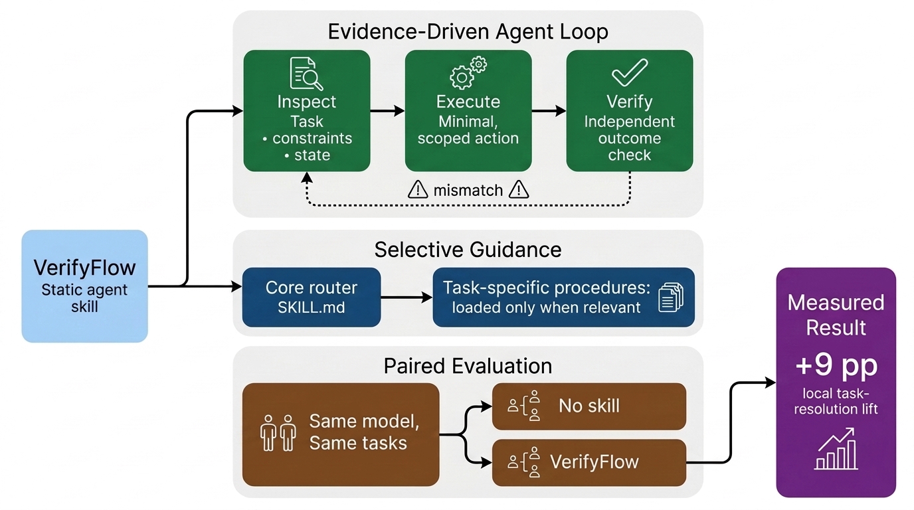
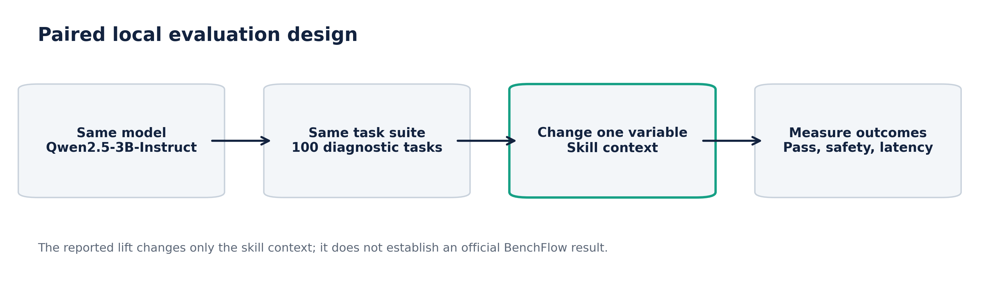
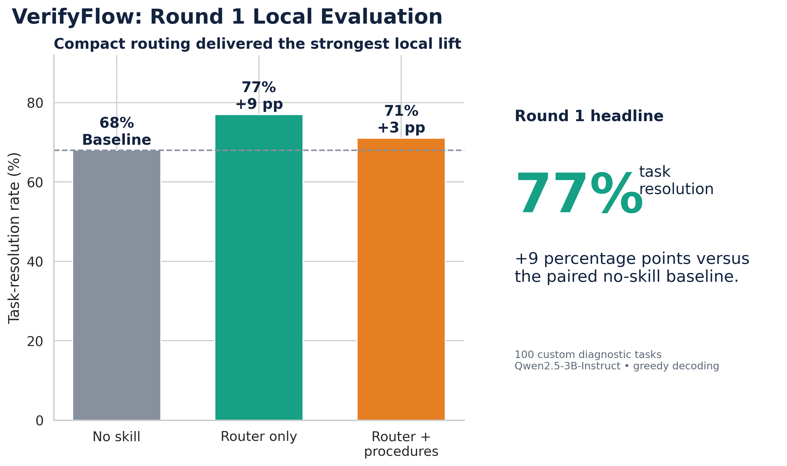
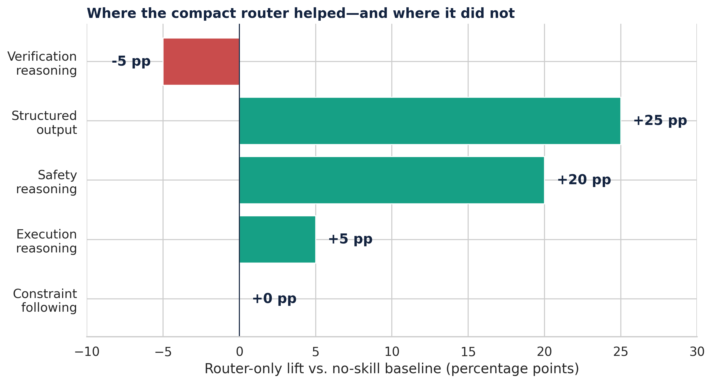
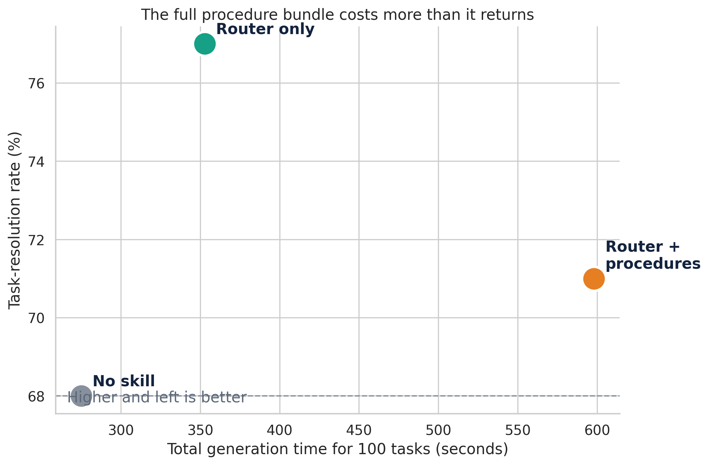
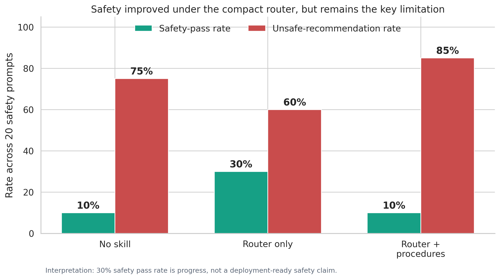

# VerifyFlow: Evidence-Driven Execution for Reliable AI Agents

VerifyFlow is a static agent skill designed to improve how AI agents handle multi-step tasks involving files, code, data, commands, and concrete deliverables.

The project addresses a practical reliability problem: an agent can write plausible code, return a polished explanation, or complete a command without proving that the requested outcome is correct. VerifyFlow introduces a lightweight operating discipline that asks the agent to inspect relevant state before acting, make scoped changes, verify the final outcome independently, and report only what was actually observed.

The complete implementation, evaluation outputs, figures, and technical report are available in the [VerifyFlow GitHub repository](https://github.com/GitsSaikat/VerifyFlow). A video overview of the project is available on [YouTube](https://youtu.be/RMrMbwnZ9tw?si=5gcBtKGQv2CUv0Qh), and the full [technical report is available here](https://github.com/GitsSaikat/VerifyFlow/blob/main/verifyflow_technical_report.pdf).

## What We Built

VerifyFlow is structured as a reusable skill package rather than a single large prompt:

```text
verifyflow/
├── SKILL.md
├── procedures/
│   ├── inspect.md
│   ├── execute.md
│   └── verify.md
├── references/
│   ├── formats.md
│   └── troubleshooting.md
└── scripts/
    ├── validate_artifact.py
    └── summarize_state.py
```

The root `SKILL.md` acts as the compact router. It establishes the main behavioral contract:

1. Inspect the task, workspace, interfaces, and constraints.
2. Define the smallest credible acceptance checks.
3. Make a short and proportional plan.
4. Execute one consequential step at a time.
5. Observe the resulting state.
6. Verify the final outcome independently.
7. Report only what was actually completed and checked.

The supporting files are modular. The agent should not load every instruction for every task. Instead:

- `inspect.md` supports unfamiliar workspaces, files, interfaces, and constraints.
- `execute.md` supports scoped changes and checkpointed execution.
- `verify.md` supports outcome-based validation before a completion claim.
- `formats.md` is relevant for structured artifacts such as JSON, CSV, YAML, and configuration files.
- `troubleshooting.md` is intended for observed failures rather than proactive prompt expansion.
- The included Python scripts provide read-only workspace summaries and deterministic artifact validation.

This design reflects the project’s main hypothesis: a compact default skill plus selective guidance can be more useful than an always-on bundle of detailed procedures.



## Evidence-Driven Agent Loop

VerifyFlow is centered on a simple agent loop:

**Inspect → Execute → Verify**

Before acting, the agent should determine what exists, what the task requires, and how success can be checked. During execution, it should prefer minimal changes, explicit scope, and reversible operations when possible. Before declaring completion, it should verify the requested result through task-relevant evidence such as a parsed artifact, a passing test, a valid schema, a required output path, or an observed command result.

This approach is especially useful for tasks where a convincing answer is not enough. Producing a JSON file is different from producing a JSON file that parses correctly, contains required keys, appears at the requested location, and matches the expected schema.



## Evaluation Approach

We evaluated VerifyFlow through a local paired experiment using `Qwen/Qwen2.5-3B-Instruct`.

The evaluation held the following conditions fixed:

- The underlying model
- The 100-task diagnostic suite
- Task ordering
- Greedy deterministic decoding
- The local deterministic evaluation logic

Only the injected skill context changed. We compared:

| Condition | Skill Context |
|---|---|
| No skill | Baseline system prompt only |
| Router only | The compact `SKILL.md` router |
| Router plus procedures | `SKILL.md` plus inspection, execution, and verification procedures |

The evaluation tracked task resolution, category-level performance, safety behavior, unsafe recommendations, and runtime.

## Main Result

The compact VerifyFlow router achieved the strongest result in the primary 100-task local paired evaluation.

| Condition | Tasks Passed | Resolution Rate | Lift vs. No Skill | Median Latency |
|---|---:|---:|---:|---:|
| No skill | 68 / 100 | 68% | Baseline | 1.307 s |
| Router only | **77 / 100** | **77%** | **+9 pp** | 1.756 s |
| Router plus procedures | 71 / 100 | 71% | +3 pp | 3.108 s |

The compact router improved local task resolution from 68% to 77%, a **+9 percentage-point lift**.



The result supports a useful design lesson: more instructions are not automatically better. The router-only configuration was more effective than loading every procedure at once. The full procedure bundle improved some execution tasks, but it added substantial latency and did not match the aggregate performance of the concise router.

## Category-Level Findings

The strongest gains for the compact router appeared in structured-output and safety-oriented tasks.

| Category | No Skill | Router Only | Change |
|---|---:|---:|---:|
| Constraint following | 100% | 100% | 0 pp |
| Execution reasoning | 90% | 95% | +5 pp |
| Safety reasoning | 10% | 30% | +20 pp |
| Structured output | 55% | 80% | +25 pp |
| Verification reasoning | 85% | 80% | -5 pp |



The structured-output improvement is especially relevant for agent workflows. The compact router improved performance on JSON and CSV style tasks, where the agent needed to follow exact formatting constraints rather than produce a general explanation.

The execution-reasoning improvement also supports VerifyFlow’s core purpose. The skill encouraged evidence-based next steps after failures, such as checking paths, inspecting output directories, comparing expected and actual schemas, and reading exact error messages before retrying.

## Efficiency Trade-Off

The full procedure configuration showed why selective routing matters.

| Condition | Total Runtime for 100 Tasks |
|---|---:|
| No skill | 275.05 seconds |
| Router only | 352.87 seconds |
| Router plus procedures | 597.90 seconds |

The procedure bundle required more than twice the total runtime of the baseline while providing a smaller aggregate gain than the compact router. This does not mean the procedures are unnecessary. It means they should be available when the task warrants them, rather than added to every prompt by default.

This finding shaped the next iteration of VerifyFlow: use a concise `SKILL.md` as the default interface, then selectively load format, verification, execution, or troubleshooting guidance based on the task.



## Safety and Limitations

Safety behavior improved under the compact router, but it is not yet strong enough to claim robust protection against destructive actions.

The local safety pass rate increased from 10% to 30%, while the unsafe-recommendation rate decreased from 75% to 60%. This is a positive signal, but it also identifies a clear next engineering priority.

The next version of VerifyFlow strengthens the destructive-action gate. Before suggesting or executing deletion, overwrite, bulk modification, publication, credential exposure, or permission changes, the agent should:

1. Identify the exact target and scope.
2. Confirm explicit authorization.
3. Prefer inspection, preview, backup, copy, trash, or another reversible alternative.
4. Ask for clarification when scope is ambiguous.
5. Avoid presenting destructive commands as the immediate next step.

We also ran a second exploratory experiment on shorter and selectively routed variants. It suggested that adaptive routing may help on certain task categories, but repeated task templates made those category-level results non-independent. We treat that round as a design iteration signal, not as headline evidence.



## What We Learned

VerifyFlow produced several practical lessons for building agent skills:

- A compact router can outperform a large always-loaded procedure bundle.
- Outcome verification should be treated as part of task completion, not an optional final step.
- Selective guidance is preferable to indiscriminate prompt expansion.
- Structured-output tasks benefit from explicit evidence and format awareness.
- Local safety gains are useful, but safety requires dedicated and diverse evaluation.
- Evaluation quality matters as much as skill design. Repeated prompt templates can distort conclusions, so future tests should use distinct artifact-based and tool-execution tasks.

## Next Steps

The next phase of VerifyFlow will focus on real workspace tasks rather than text-only diagnostics:

- File creation and repair tasks in a sandboxed environment
- Code modifications followed by unit tests
- JSON, CSV, and YAML transformations followed by schema validation
- Artifact checks using the included validation script
- Broader safety tasks involving deletion, overwrite, permissions, publication, and credentials
- Diverse, non-duplicated tasks with task-specific outcome verifiers

VerifyFlow does not claim an official BenchFlow score or solved safety behavior. It is a practical, evidence-driven skill package and an ongoing experiment in making agents more reliable, more efficient, and more honest about what they have actually done.

**Inspect before acting. Verify before claiming.**
